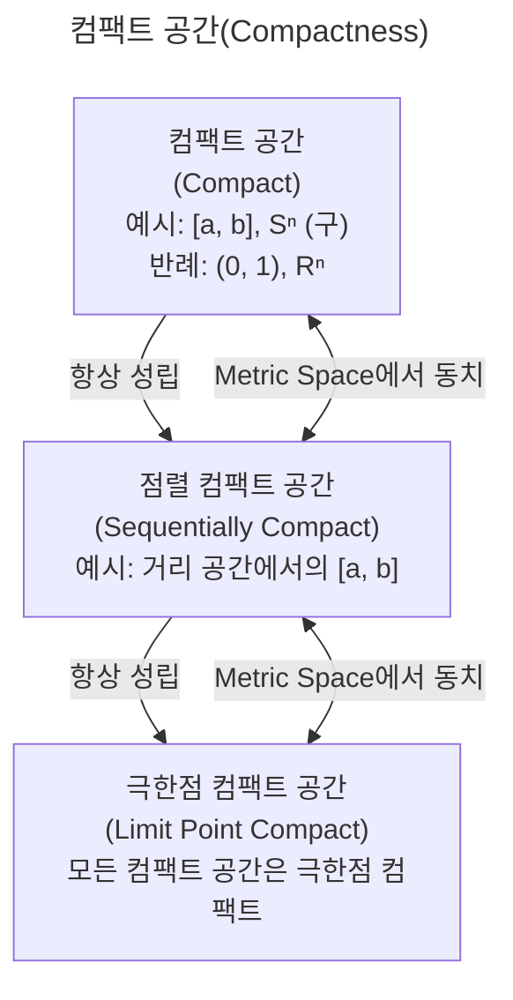

## 컴팩트

```mermaid
---
title: 컴팩트 공간(Compactness)
---

graph TD;
    %% 노드 정의 (개념과 예시)
    A["컴팩트 공간<br>(Compact)<br>예시: [a, b], Sⁿ (구)<br>반례: (0, 1), Rⁿ"];
    B["점렬 컴팩트 공간<br>(Sequentially Compact)<br>예시: 거리 공간에서의 [a, b]"];
    C["극한점 컴팩트 공간<br>(Limit Point Compact)<br>모든 컴팩트 공간은 극한점 컴팩트"];
    %% 관계 정의 (화살표와 조건)
    A --"항상 성립"--> B;
    B --"항상 성립"--> C ;
    A <-- "Metric Space에서 동치" --> B;
    B <-- "Metric Space에서 동치" --> C;
```

